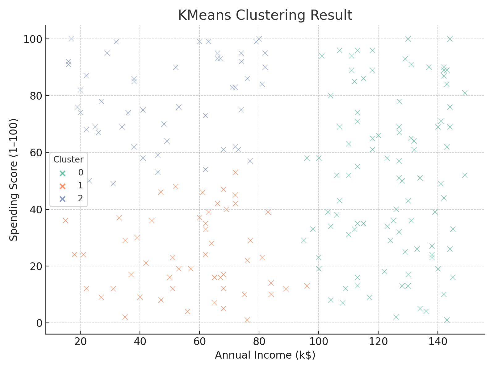
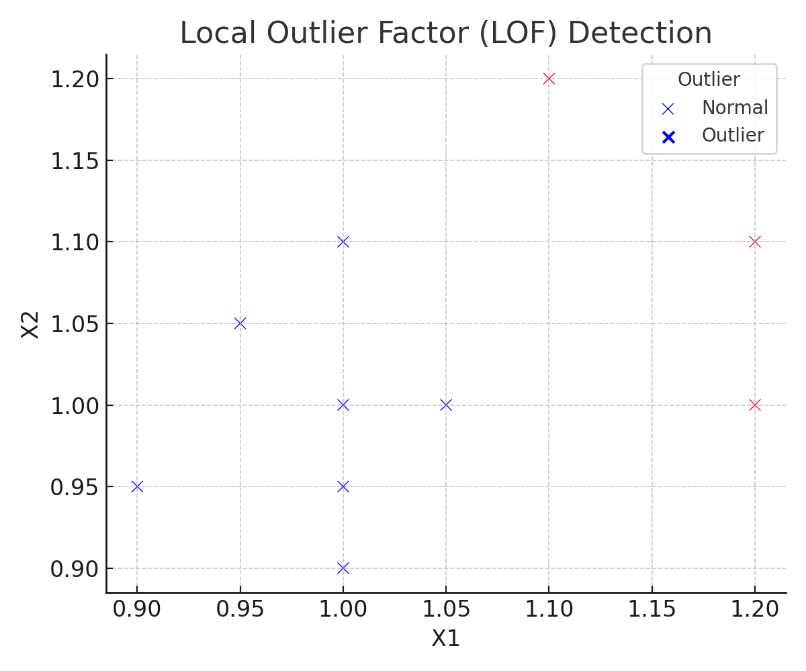

# 嶺山科技大學大數據分析期中考成果報告 📊


本專案為期中考三大主題之 Python 實作，包括視覺化圖表與程式摘要，手寫整理與說明。作為個人學習紀錄展示。

---

## 📌 題目一：分群分析（Clustering）

- 使用 KMeans 對顧客的 Annual Income 與 Spending Score 分群（K=3）
- 使用 seaborn 畫出三群分布圖

🔍 群體解釋：
- Cluster 0: 中等收入，高消費（消費型）
- Cluster 1: 高收入，低消費（節儉型）
- Cluster 2: 低收入，低消費（保守型）



---

## 📌 題目二：異常偵測（Anomaly Detection）

- 使用 LOF (Local Outlier Factor) 模型偵測 10 筆資料的異常值
- 取 LOF 分數最高的前三筆為 Outlier

🔍 紅色叉叉代表異常點，藍色為正常點。



---

## 📌 題目三：關聯規則探勘（Association Rules）

- 使用 Apriori 挖掘出支援度 >= 0.6 的頻繁項集
- 對這些項集產生信賴度 >= 0.8 的關聯規則

🔍 最有趣的規則：
**{牛奶, 尿布} → {麵包}**  
信賴度為 0.8，表示購買牛奶與尿布的人，有 80% 的機率也會購買麵包，具備行銷潛力。

---

## 📁 專案結構

| 檔案名稱              | 說明                       |
|-----------------------|----------------------------|
| `bigdata_midterm.ipynb` | Jupyter Notebook 主程式     |
| `bigdata_midterm.py`    | Python 腳本版              |
| `q1_kmeans_en.png`      | 分群分析結果圖             |
| `q2_lof_en.png`         | LOF 異常偵測視覺圖         |
| `README.md`             | 專案說明文件               |
| `requirements.txt`      | Pip 安裝所需的套件清單     |

---

## 🚀 執行環境需求

```bash
pip install -r requirements.txt
```

或個別安裝：

```bash
pip install pandas numpy matplotlib seaborn scikit-learn mlxtend
```

---
